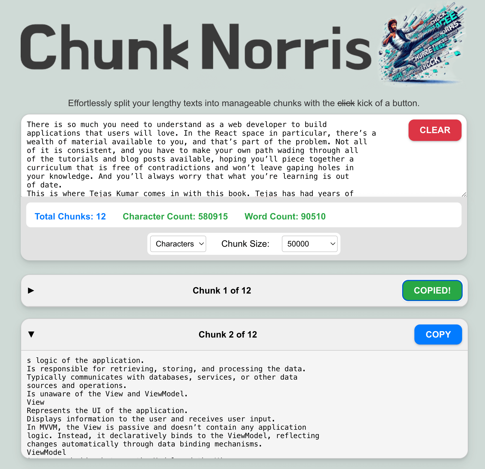

# Chunk Norris - Text Splitter
Effortlessly split your lengthy texts into manageable chunks with the kick of a button. 

## Features:
- Split by characters or words
- Adjustable chunk sizes
- User-friendly interface
- Instant results

Perfect for content creators, developers, and anyone working with large text blocks. Streamline your workflow and make text processing a breeze!

[Live Demo](https://jamesalmeida.github.io/chunk-norris/)



## Quick Start

1. Clone the repository:
   ```
   git clone https://github.com/yourusername/ai-chat-history.git
   cd ai-chat-history
   ```

2. Install dependencies:
   ```
   npm install
   ```

3. Start the development server:
   ```
   npm start
   ```

4. Open [http://localhost:3000](http://localhost:3000) in your browser.

## Deploying to GitHub Pages

1. Update the `homepage` field in `package.json`:
   ```json
   "homepage": "https://yourusername.github.io/ai-chat-history"
   ```
   The scripts section should already be configured as so:
   ```json
   "scripts": {
     "predeploy": "npm run build",
     "deploy": "gh-pages -d build"
   }
   ```

2. Setup Github Pages:
   gh-pages is already installed as a dev dependency, but you need to configure it.
   - In the github repo, navigate to `Settings` -> `Pages`
   - Under `Source`, select the `gh-pages` branch as the publishing source
   - Click `Save` and the page will automatically refresh.

3. Deploy the application:
    In the terminal, run:
   ```
   npm run deploy
   ```

4. Your application will be available at `https://yourusername.github.io/chunk-norris`

## Contributing

Contributions are welcome! Please feel free to submit a Pull Request.

## License

This project is licensed under the MIT License. See the `LICENSE` file for more details.